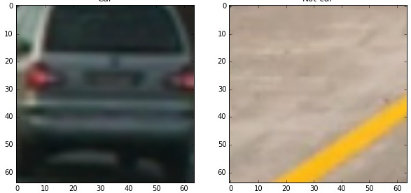
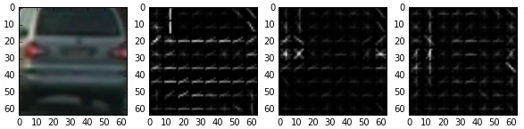
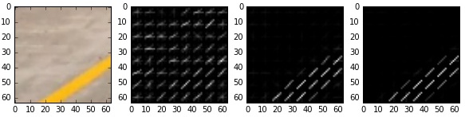
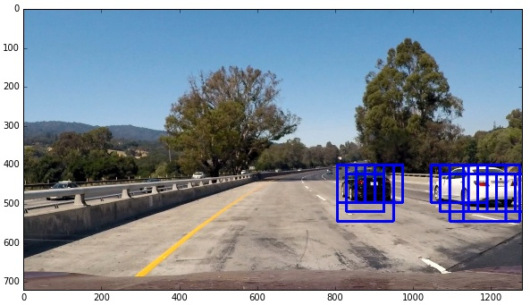
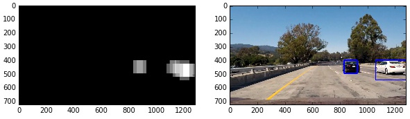
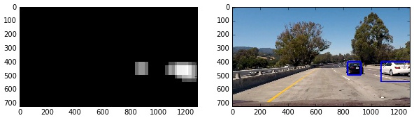
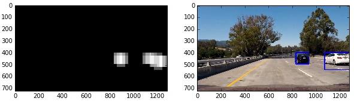

##Vehicle Detection
###A software pipeline to detect vehicles in a video from a front-facing camera on a car.

---

**The pipeline is implemented in `main.py` and includes the following features:**

* Perform a Histogram of Oriented Gradients (HOG) feature extraction on a labeled training set of images and train a classifier Linear SVM classifier
* Apply a color transform and append binned color features, as well as histograms of color, to the HOG feature vector. 
* A sliding-window technique and using using the trained classifier to search for vehicles in images.
* Processing a video stream (e.g. test_video.mp4) and create a heat map of recurring detections frame by frame to reject outliers and follow detected vehicles.
* Estimate a bounding box for vehicles detected.

[//]: # (Image References)
[image1]: ./examples/car_not_car.png
[image2]: ./examples/HOG_example.jpg
[image3]: ./examples/sliding_windows.jpg
[image4]: ./examples/sliding_window.jpg
[image5]: ./examples/bboxes_and_heat.png
[image6]: ./examples/labels_map.png
[image7]: ./examples/output_bboxes.png
[video1]: ./project_video.mp4

###Histogram of Oriented Gradients (HOG)

####1. Extracting (HOG) features from the training images.

The training images are loaded in the cell titled as `# Read images` in `main.py`. The images are categorized in two classes `vehicle` and `non-vehicle`.  Here is an example of each class:

 

The images are then passed to `extract_features(imgs()` function to
calculate a set of features that will be used in training a classifier.

Three methods are used for extracting the features:

 * Spatial binning of the pixels
 * Color histograms
 * Histogram of Oriented Gradients (HOG) using `skimage.feature.hog`
 
These methods can be applied on images in different color spaces. 
Moreover, they have multiple parameters such as the size and number of bins when it comes to histograms and binning. 
After several manual iterations the best results were obtained by 
using all three methods on `YCrCb` color-space. 

The part of code that extracts these features is

```
# color_space:  Can be RGB, HSV, LUV, HLS, YUV, YCrCb
# orient: HOG orientations
# pix_per_cell: HOG pixels per cell
# cell_per_block: HOG cells per block
# hog_channel: Can be 0, 1, 2, or "ALL"
# spatial_size: Spatial binning dimensions
# hist_bins: Number of histogram bins
# spatial_feat: Spatial features on or off
# hist_feat: Histogram features on or off
# hog_feat: HOG features on or off

car_features = extract_features(cars, color_space=color_space, 
                        spatial_size=spatial_size, hist_bins=hist_bins, 
                        orient=orient, pix_per_cell=pix_per_cell, 
                        cell_per_block=cell_per_block, 
                        hog_channel=hog_channel, spatial_feat=spatial_feat, 
                        hist_feat=hist_feat, hog_feat=hog_feat)
```
 
The tuning procedure for these parameters is discussed in the next section.

For the two figures shown above if we use  `YCrCb` color space and HOG parameters of `orientations=8`, `pixels_per_cell=8` and `cells_per_block=2` the features extracted from the three channels look like this:

 
 


####2. Design procedure for choosing the final values of HOG parameters

The tunning was automated in a brute-force fashion and the performance
was evaluated on the test set. More specifically, a search was performed
on all color-spaces, HOG parameters, chosen image channels, number and size of bins, and enabling/disabling feature extraction methods.

The final choice of parameters is given below which :
```
color_space = 'YCrCb' # Can be RGB, HSV, LUV, HLS, YUV, YCrCb
orient = 8  # HOG orientations
pix_per_cell = 8 # HOG pixels per cell
cell_per_block = 2 # HOG cells per block
hog_channel = 'ALL' # Can be 0, 1, 2, or "ALL"
spatial_size = (16, 16) # Spatial binning dimensions
hist_bins = 32    # Number of histogram bins
spatial_feat = True # Spatial features on or off
hist_feat = True # Histogram features on or off
hog_feat = True # HOG features on or off
```

####3. Training a classifier

The extracted features are fed to a Linear SVC model and evaluated 
on the test set. The final test accuracy error is 98.82%

```
svc = LinearSVC(max_iter=20000)
svc.fit(X_train, y_train)
print('Test Accuracy of SVC = ', round(svc.score(X_test, y_test), 4))
```

###Sliding Window Search


The sliding window search consists of two main functions:  `slide_window` that generates the searching windows and `search_windows` that looks into the generated windows and runs the classifier on that patch to find the cars.

The size of windows and the search region for each scale are determined manually by looking at a few images with close and far away cars. After 
some iterations the following four sets are chosen.

```
windows = slide_window(image, x_start_stop=[300, None], y_start_stop=[400, 500], 
                    xy_window=(96, 96), xy_overlap=(0.75, 0.75))
windows += slide_window(image, x_start_stop=[300, None], y_start_stop=[400, 500], 
                    xy_window=(144, 144), xy_overlap=(0.75, 0.75))
windows += slide_window(image, x_start_stop=[300, None], y_start_stop=[430, 550], 
                    xy_window=(192, 192), xy_overlap=(0.75, 0.75))
windows += slide_window(image, x_start_stop=[300, None], y_start_stop=[460, 580], 
                    xy_window=(192, 192), xy_overlap=(0.75, 0.75))
```
where ` xy_window` determines the size (scale) of windows, `xy_overlap` corresponds to the overlapping ratio of windows, 
and `x_start_stop, y_start_stop` are tuples that determine the search region.

The following plot shows the windows in which a car was detected.
 


---

### Video Processing

Processing the video frames is implemented in `process_image(image)` and consists of two steps: 
* Running *Sliding Window Search* (i.e. `search_windows()`) to find the windows that contain a car
* Combining the boxes together, rejecting outliers and temporal filtering to establish an accurate and smoothly moving location for each car in the image

The first part is already explained in the previous sections. For temporal filtering and outlier rejection a class with name `state` is defined that 
incorporates the history of *heat maps*, car locations and final box positions. 

Once the detection is performed on searching windows, the windows 
with positive detection are passed to `find_labels()` function. In this 
stage the individual windows contribute to a unique heat map and 
we assign one label to each continuous patch in that heat map. In other words, we combine the windows by replacing them with a heat map.

To smooth out the heat map and remove the outliers, an exponential filtering (1st order transfer function with a pole at 0.3) is applied to the 
heat map. 

To remove the outliers and also avoid detecting multiple cars when the 
heat map patch of one car is split into multiple parts we monitor the number of detected cars in time and apply a median filter to it.
More specifically, the number of detected cars in each frame is equal to the median of the number of labels detected in that frame and the past 9 frames.

On top of the previous two filtering mitigations, we use a median filter 
on the location and size of boxes that are drawn around the cars. This 
makes the shape and location of boxes change more smoothly in time and avoids any sudden changes in the appearance of those boxes.

Here are three examples of filtered heat maps and detected cars from the output video:


 
 
 

###Final video output
Here's a [link](https://youtu.be/-sxc0D1V39g)  to the video output on YouTube.

 

---

###Discussion

####Potential Failures:
The algorithm fails when the cars are close to each other because the 
corresponding patches in the heat map gets merged together. 

The time complexity of algorithm scales linearly with the overlap ratio of searching windows. As a result, detecting precise position of the cars, especially farther ones, requires high computation power when it comes to on the fly implementation.

####Future Work:
In order to distinguish the close cars, one can use a clustering method to split the merged patches into number of cars clusters. In this case, the number of cars should be inferred from the frames before the cars get too close to each other.

Moreover, the current algorithm can be improved by taking the temporal relation between the position of other cars in consecutive frames. 
Bayesian filtering of car position would be a simple method to do so. For instance, the heat map calculated in
each frame can be normalized to a probability distribution and used in the next frame as a prior probability. The 
position of cars is then defined as the argmax of posterior probability. 
More complex methods like Kalman filtering and particle filtering can be employed to incroporate the speed and car dynamics as well.
